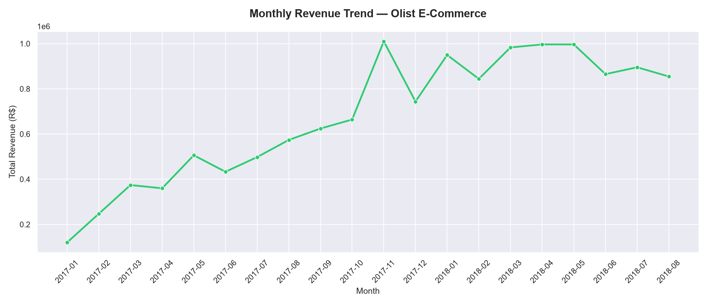
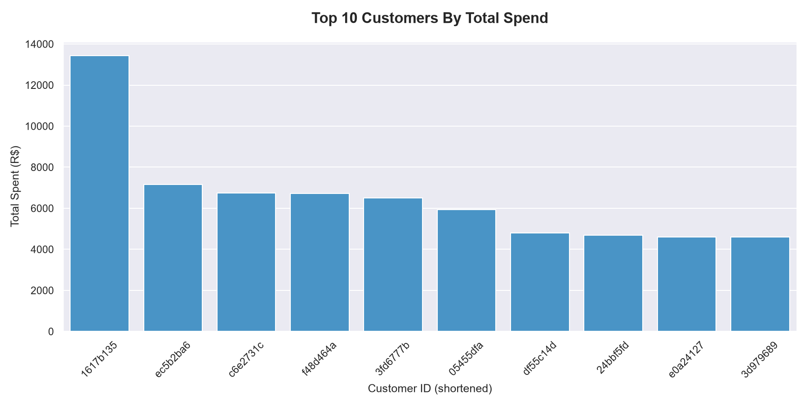
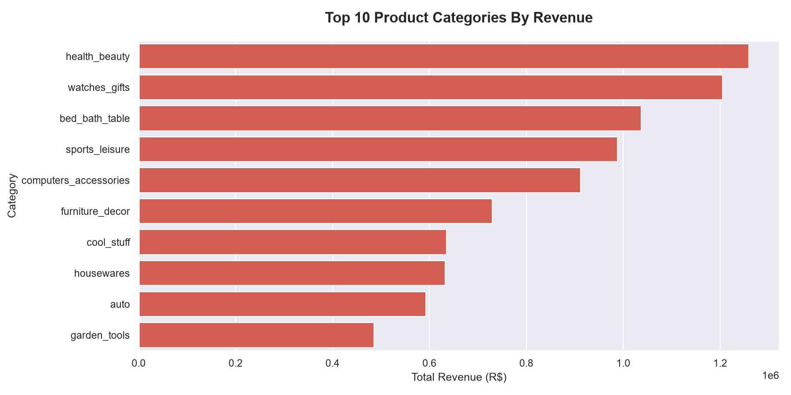
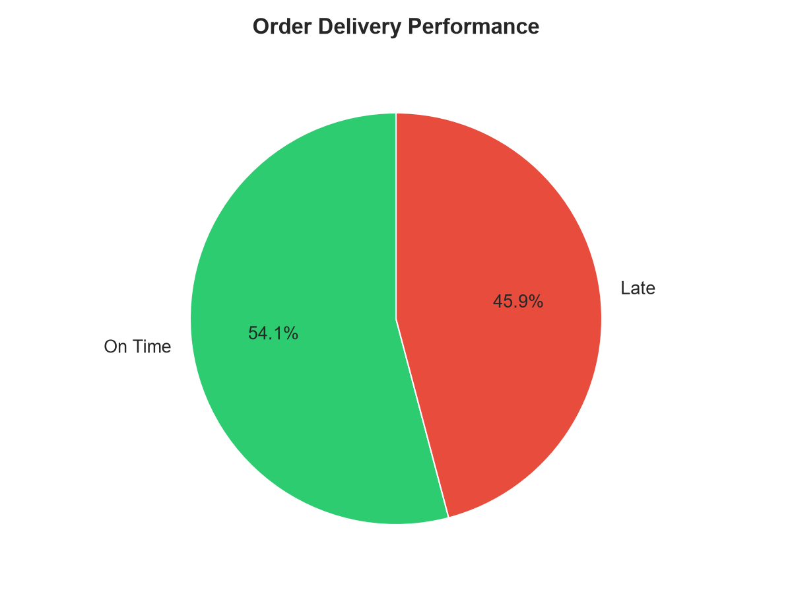
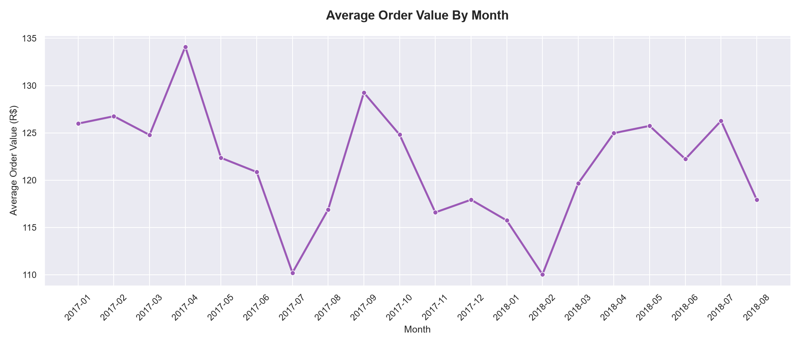

# Olist E-Commerce Analysis
### SQL Portfolio Project — Azeem Malik

---

## Project Overview
This project analyses 99,441 real orders from 
Olist, a Brazilian e-commerce marketplace. 
Using SQL and Python I answered five key 
business questions to uncover trends in 
revenue, customer behaviour, and delivery 
performance.

---

## Tools Used
- SQL (SQLite)
- Python (pandas, sqlite3)
- VS Code
- Dataset: Olist Brazilian E-Commerce (Kaggle)

---

## Business Questions Answered

### Question 1 — Monthly Revenue Trend
How did revenue trend month by month?

**Key Finding:** Revenue grew consistently 
from £49K in October 2016 to over £1M in 
November 2017 — likely driven by Black Friday. 
Revenue stabilised at around £900K per month 
through 2018.

---

### Question 2 — Top 10 Customers By Spend
Who are our highest spending customers?

**Key Finding:** The top customer spent £13,440 
— almost double the second highest spender 
at £7,160. These customers are strong 
candidates for a VIP loyalty programme.

---

### Question 3 — Best Performing Categories
Which product categories generate the most revenue?

**Key Finding:** Health and beauty is the 
top category at £1.26M total revenue, 
followed closely by watches and gifts at £1.2M. 
These two categories alone account for a 
significant portion of total revenue.

---

### Question 4 — Delivery Performance
How many orders were delivered on time vs late?

**Key Finding:** 46% of orders arrived late. 
This is a significant operational issue 
that is likely hurting customer satisfaction 
and repeat purchase rates.

---

### Question 5 — Average Order Value By Month
What was the average order value each month?

**Key Finding:** Average order value remained 
consistently between £110 and £136 throughout 
the dataset. Interestingly during the November 
2017 revenue spike the average order value 
actually dropped to £116 — suggesting more 
customers were buying cheaper items in bulk 
rather than fewer expensive items.

---

## Charts

### Monthly Revenue Trend

### Top 10 Customers By Spend

### Top 10 Categories By Revenue

### Delivery Performance

### Average Order Value By Month

## How To Run This Project

1. Clone this repository
2. Install dependencies:
   pip install pandas
3. Run the database setup:
   python setup_database.py
4. Run the analysis:
   python analysis.py

---

## About Me
Junior Data Analyst with a background in 
NHS digital transformation and EPR 
implementation. Currently building data 
analytics skills in SQL and Python.